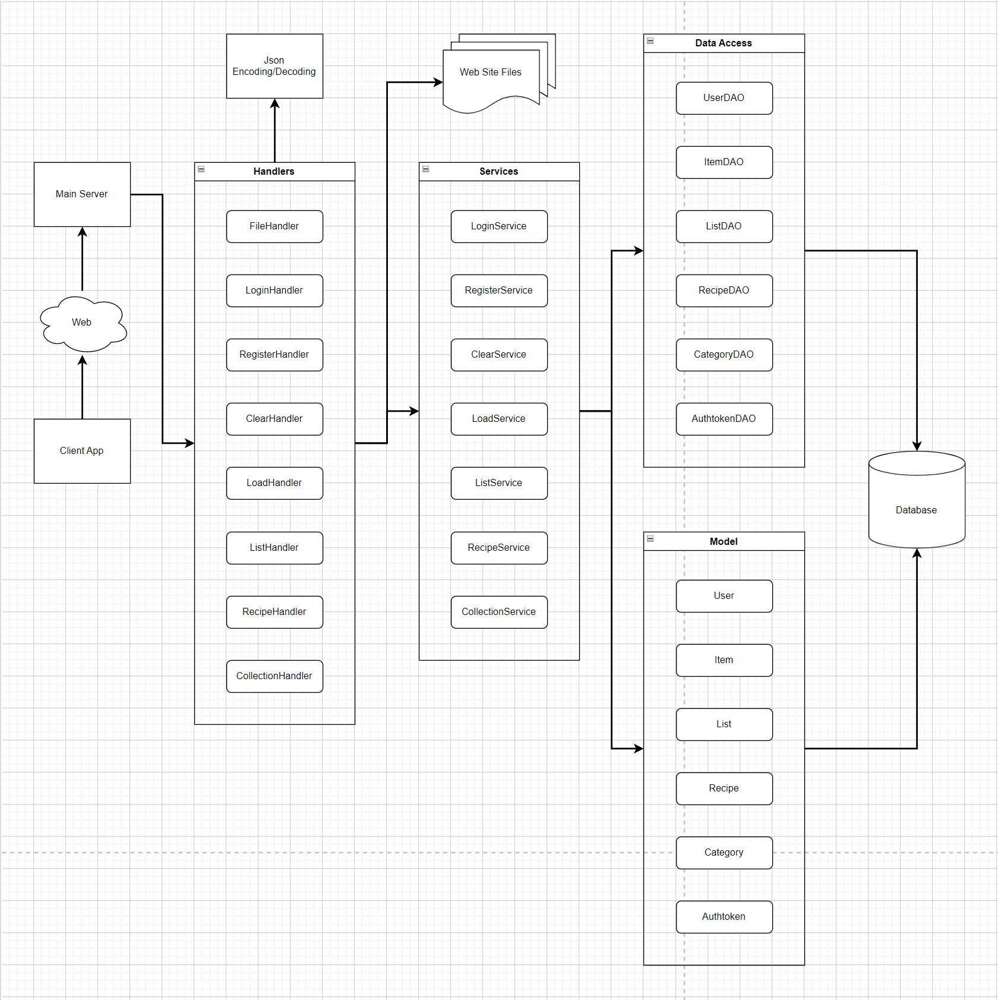
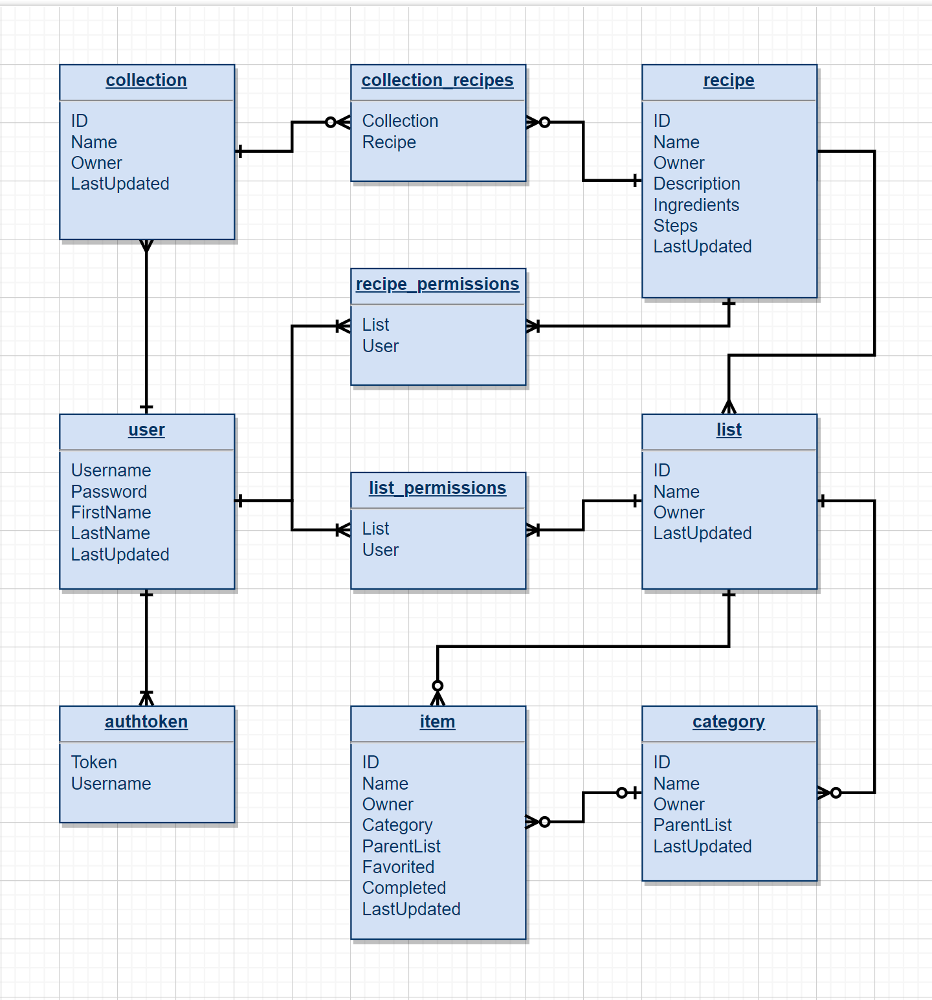

# FamilyListServer

This is the server for the Sahleen-McKay (SM) List application.
This server allows for users of the SMList application to remotely store 
their data in its internal database, as well as share their lists and/or
recipes with other users.

This server is mostly written in Java using its built in HTTP server
and SQLite database interaction capabilities.

---

## Server Organization

The server is designed to take in HTTP requests from the application client
over the internet, and use those requests to interact with the internal database.

The server is organized into the following elements:
- `Server` - The main Java class for the server. This class starts the server and
is the root process for the server.
- `Handlers` - This Java package contains the classes that handle the HTTP
requests that come in over the internet.
- `Services` - This Java package contains the main processing and data management
that is performed by the server and provides its primary functionality.
- `Data Access Objects (DAOs)` - This Java package contains the classes that
directly interact with the database to add, remove, and update its stored data.
- `Models` - This Java package contains the classes used to represent the
different objects whose data is stored in the database.
- `Database` - The internal database that stores all the data for each user. This
also stores generic, public data that can be accessed by all users as well as 
enables users to share their data with others should they choose to do so.
- `Website` - The server also has a simple website that can be used to interact
with the database, test server functionality, and access the server's documentation.




---

## Database

The server's database stores all user, public, and data sharing information.
It is implemented using SQLite and Java's native SQLite database interaction
functionality and classes.

The database has tables to store information for the following objects:
- Users
- Authtokens
- Items
- Categories
- ItemLists
- Recipes
- Collections
- CollectionRecipes
- ListPermissions
- RecipePermissions

_The following image shows the database's relational structure:_



---

## Web API

The server accepts internet traffic in the form of HTTP requests.
These requests are parsed in following the server's Web API before being
sent to their proper handler. The HTTP requests may include data to be
transferred between the server and an application client. This data will
be stored in JSON format in the body of the HTTP request. Some requests
may also require an authentication token (Authtoken) for the user's current
session to be included in the request's header for the server to accept it.

The Web API is detailed below as follows:

### _File_
__Path:__ /  
__Type:__ GET  
__Description:__ Gets a webpage file from the web directory.  
__Authtoken Required:__ No  
__Request Body:__ None  
__Result Body:__ Webpage HTML/CSS contents

### _Load_
__Path:__ /load  
__Type:__ POST  
__Description:__ Loads the data from the JSON data in the request body into the database.  
__Authtoken Required:__ No  
__Request Body:__  
```json
{
    "users":[
        {
            User
        },
        …
        {
            User
        }
    ],
    "lists":[
        {
            List
        },
        …
        {
            List
        }
    ],
    "collections":[
        {
            Collection
        },
        …
        {
            Collection
        }
    ],
    "recipes":[
        {
            Recipe
        },
        …
        {
            Recipe
        }
    ],
    "categories":[
        {
            Category
        },
        …
        {
            Category
        }
    ],
    "items":[
        {
            Item
        },
        …
        {
            Item
        }
    ],
    "listPermissions":[
        [
            "listID",
            "Username"
        ],
        …
        [
            "listID",
            "Username"
        ]
    ],
    "recipePermissions":[
        [
            "recipeID",
            "Username"
        ],
        …
        [
            "recipeID",
            "Username"
        ]
    ],
    "collectionRecipes":[
        [
            "collectionID",
            "recipeID"
        ],
        …
        [
            "collectionID",
            "recipeID"
        ]
    ],
    "clearDatabase": clearDatabase
}
```
__Result Body:__  
```json
{
    "message": "message",
    "success": "success"
}
```

### _Load from File_
__Path:__ /load/[filepath]  
__Type:__ POST  
__Description:__ Loads the database with the data in the JSON file pointed to by
the provided filepath.
__Authtoken Required:__ No  
__Request Body:__ None  
__Result Body:__  
```json
{
    "message": "message",
    "success": "success"
}
```

### _Clear_
__Path:__ /clear  
__Type:__ POST  
__Description:__ Clears all data in the database.  
__Authtoken Required:__ Yes (Admin authtoken)  
__Request Body:__ None  
__Result Body:__  
```json
{
    "message": "message",
    "success": "success"
}
```

### _Login User_
__Path:__ /user/login  
__Type:__ POST  
__Description:__ Logs in a user using the credentials provided in the request body
and returns a generated authtoken for the user's current session.  
__Authtoken Required:__ No  
__Request Body:__  
```json
{
    "username": "username",
    "password": "password"
}
```
__Result Body:__  
```json
{
    "authtoken": "authtoken",
    "username": "username",
    "message": "message",
    "success": "success"
}
```

### _Register User_
__Path:__ /user/register  
__Type:__ POST  
__Description:__ Registers a new user using the credentials provided in the
request body and returns a generated authtoken for the user's current session.  
__Authtoken Required:__ No  
__Request Body:__  
```json
{
    "username": "username",
    "password": "password",
    "firstName": "firstName",
    "lastName": "lastName"
}
```
__Result Body:__  
```json
{
    "authtoken": "authtoken",
    "username": "username",
    "message": "message",
    "success": "success"
}
```

### _Sync Collections_
__Path:__ /collections  
__Type:__ PUT  
__Description:__ Synchronizes the client and server contents of the user's collection data.  
__Authtoken Required:__ Yes  
__Request Body:__  
```json
{
    "data": [
        {
            Collection
        },
        …
        {
            Collection
        }
    ],
    "associations": [
        Permissions (Collection -> Recipe),
        …
        Permissions (Collection -> Recipe)
    ],
    "removals": [
        "collectionID",
        …
        "collectionID"
    ],
    "revocations": [
        Permissions (Collection -> Recipe),
        …
        Permissions (Collection -> Recipe)
    ]
}
```
__Result Body:__  
```json
{
    "message": "message",
    "syncData": [
        {
            Collection
        },
        …
        {
            Collection
        }
    ],
    "syncAssociations": [
        Permissions (Collection -> Recipe),
        …
        Permissions (Collection -> Recipe)
    ],
    "success": "success"
}
```

### _Sync Lists_
__Path:__ /lists  
__Type:__ PUT  
__Description:__ Synchronizes the client and server contents of the user's list data.  
__Authtoken Required:__ Yes  
__Request Body:__
```json
{
    "data": [
        {
            List
        },
        …
        {
            List
        }
    ],
    "permissions": [
        Permissions (User -> List),
        …
        Permissions (User -> List)
    ],
    "removals": [
        "listID",
        …
        "listID"
    ],
    "revocations": [
        Permissions (User -> List),
        …
        Permissions (User -> List)
    ]
}
```
__Result Body:__
```json
{
    "message": "message",
    "syncData": [
        {
            List
        },
        …
        {
            List
        }
    ],
    "syncPermissions": [
        Permissions (User -> List),
        …
        Permissions (User -> List)
    ],
    "success": "success"
}
```

### _Sync Recipes_
__Path:__ /recipes  
__Type:__ PUT  
__Description:__ Synchronizes the client and server contents of the user's recipe data.  
__Authtoken Required:__ Yes  
__Request Body:__
```json
{
    "data": [
        {
            Recipe
        },
        …
        {
            Recipe
        }
    ],
    "permissions": [
        Permissions (User -> Recipe),
        …
        Permissions (User -> Recipe)
    ],
    "removals": [
        "recipeID",
        …
        "recipeID"
    ],
    "revocations": [
        Permissions (User -> Recipe),
        …
        Permissions (User -> Recipe)
    ]
}
```
__Result Body:__
```json
{
    "message": "message",
    "syncData": [
        {
            Recipe
        },
        …
        {
            Recipe
        }
    ],
    "syncPermissions": [
        Permissions (User -> Recipe),
        …
        Permissions (User -> Recipe)
    ],
    "success": "success"
}
```
